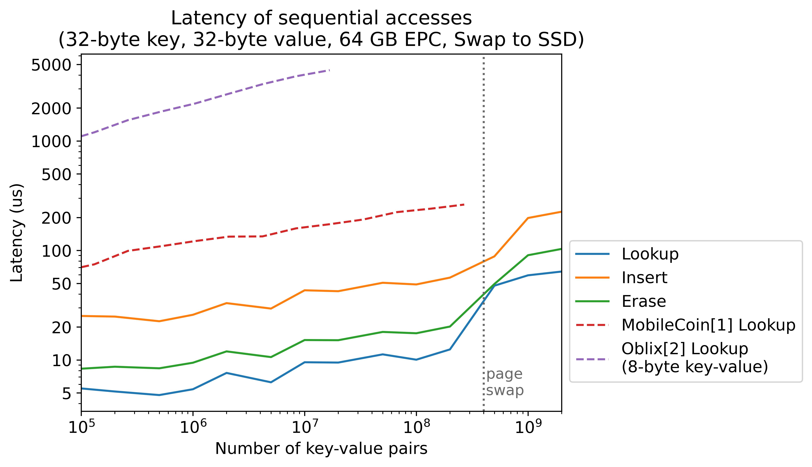
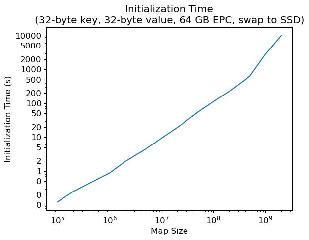
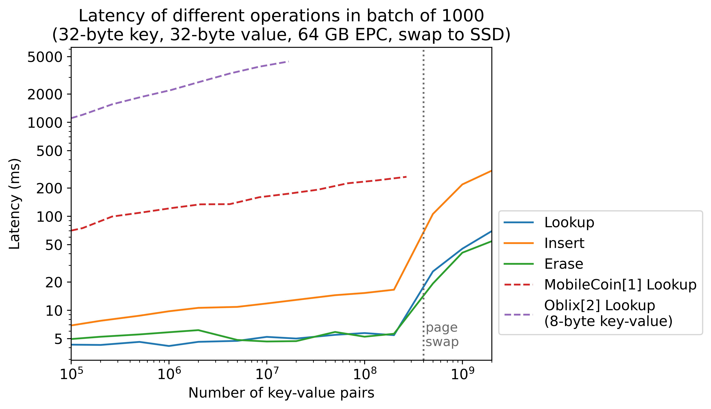
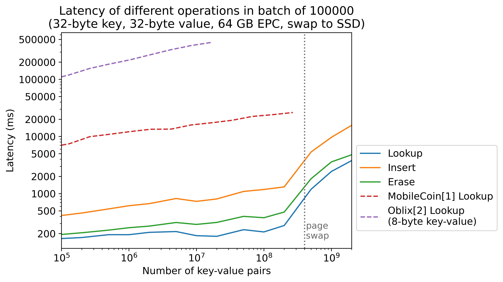
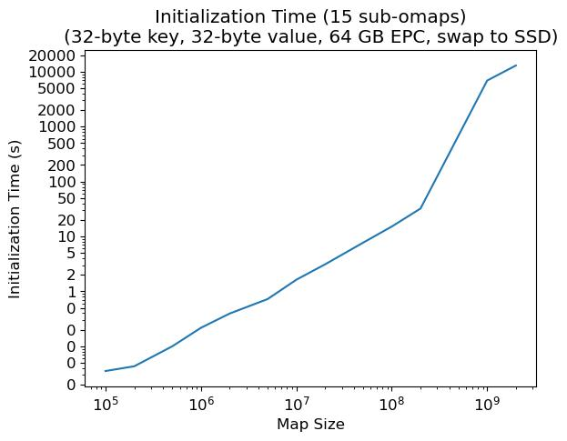

# Doubly-efficient Unbalanced PSI and PSU from Trusted Hardware

This repository hosts the implementation of **Doubly-efficient Unbalanced Private Set Intersection (PSI)** and **Private Set Union (PSU)** protocols leveraging Trusted Execution Environments (TEEs) such as Intel SGX with offline pre-processing. The underlying technical core of these protocols is a highly optimized, external-memory efficient **Parallel Oblivious Map** that ensures both memory access patterns and disk swaps appear independent of the secret data, providing privacy guarantees beyond standard encryption.

## Supported Protocols

Our framework provides implementations for six distinct cryptographic protocols, which are covered in depth in the associated document:

1. **Unbalanced Private Set Intersection (PSI):** A doubly-efficient protocol for unbalanced sets leveraging trusted hardware.
2. **Updatable Unbalanced PSI:** Designed for dynamic datasets, with robust applications such as privacy-preserving password monitoring.
3. **Unbalanced Private Set Intersection Cardinality (PSI-CA):** Securely computes only the size of the intersection between two sets.
4. **Unbalanced Private Set Union (PSU):** Securely computes the union of unbalanced datasets with optimal communication complexity.
5. **Updatable Unbalanced PSU:** Supports dynamic log collections and privacy-preserving data aggregation with server-side deletions.
6. **Unbalanced Private Set Union Cardinality (PSU-CA):** Computes only the size of the set union.

## Prerequisites

Install CMake, Ninja, and the Intel SGX SDK, or use the provided `cppbuilder` Docker image for a reproducible and streamlined setup.

## Running the Project

We strongly recommend using the Docker environment to run the project. The primary entry point for testing the algorithms is the `algo_runner.sh` script.

### 1. Build the Docker Image
```bash
docker build -t cppbuilder:latest ./tools/docker/cppbuilder
```

### 2. Enter the Docker Environment (Hardware Mode)
To run the algorithms in a true enclave environment, launch the container with privileged access:
```bash
docker run -v /tmp/omapbackend:/ssdmount --privileged -it --rm -v $PWD:/builder -p 8080:8080 cppbuilder
```

### 3. Run the Protocols
Once inside the Docker container, you can execute the sample script to test the runtime of the protocols and the underlying oblivious map algorithms:
```bash
cd applications/omap
./algo_runner.sh
```

### 4. Running Unit Tests (Optional)
If you wish to run the unit tests independently, you can start a non-privileged container:
```bash
docker run -it --rm -v $PWD:/builder -u $(id -u) cppbuilder
```
Then, execute the test suite:
```bash
rm -rf build
cmake -B build -G Ninja
ninja -C build
ninja -C build test
```
To run tests in release mode:
```bash
rm -rf build 
export CC=/usr/bin/gcc
export CXX=/usr/bin/g++
cmake -B build -G Ninja -DCMAKE_BUILD_TYPE=Release
ninja -C build
```

## Manual Enclave Builds

If you are not using the `algo_runner.sh` script, you can build the example enclaves manually:

**Hardware Mode:**
```bash
source /startsgxenv.sh
cd applications/omap
make
```

**Simulation Mode:**
```bash
source /startsgxenv.sh
cd applications/omap
make SGX_MODE=SIM
```

## Folder Structure

- `omap` - C++ oblivious map library code
- `tests` - C++ tests modules
- `applications` - Enclaves example of omap
- `tools` - Tools for generating graphs or test sets
- `tools/docker` - Dockerfiles used for reproducible builds

### `omap` Structure Detailed
- `odsl` - Core library code of oblivious data structures
- `algorithm` - Algorithmic building blocks for oblivious data structures
- `common` - Common C++ utilities, CPU abstractions, cryptography abstractions, and tracing code
- `external_memory` - External memory vector abstraction
- `external_memory/server` - Server abstraction for different external memory scenarios (SGX, file system, RAM)
- `interface` - Foreign language interfaces

## Performance Benchmark

The benchmark below is conducted in SGX prerelease mode with an Intel(R) Xeon(R) Platinum 8352S processor (48M Cache, 2.20 GHz). We limit the enclave size to be 64 GB, and swap the rest of the data to an SSD.

### Sequential Access

First, we test the average latency of sequential access. In the test, each access is launched right after the previous access returns the result. A pipelining optimization is enabled to utilize multiple cores.





### Batch Access

Then, we test the average latency for a batch of accesses. The accesses are obliviously load-balanced to multiple sub-omaps and processed in parallel. When data fits in the enclave, batched access is faster than sequential access due to more parallelism; otherwise, the performance is close since both are limited by the I/O bandwidth.







## Architecture Overview

Below, we give an overview of our oblivious data structure in a top-down order.

### Parallel Oblivious Map for Batch Queries
When queries are received in batches, we implement an oblivious load balancing mechanism to distribute them across multiple shards of the oblivious map, enabling parallel query processing. Drawing inspiration from Snoopy (https://eprint.iacr.org/2021/1280), we have refined and optimized their load balancing algorithm. The corresponding implementation is available at `odsl/par_omap.hpp`.

### Oblivious Map
Our oblivious map employs blocked cuckoo hashing with a stash to map long keys from a sparse space to memory addresses in a denser space. Using two hash tables, T1 and T2, an element x can be located in either location h1(x) of T1 or h2(x) of T2, utilizing hash functions h1 and h2 respectively. Each location can store multiple elements, increasing associativity and the load factor of the cuckoo hash tables. When both locations are full, the element may be stored in a stash. Cuckoo hashing offers O(1) worst-time complexity for look-up and deletion, making it ideal for oblivious data structures that conceal access counts during probing.

Insertion involves repeatedly evicting existing elements from the table when collisions occur. A naive approach to support oblivious insertion pads the number of evictions to a maximum threshold. Our map reduces the number of accesses by deamortizing evictions using the stash.

For keys and values under 32 bytes, it is efficient to store them directly in the cuckoo hash table (`odsl/omap_short_kv.hpp`). Longer keys and values are processed by cuckoo hashing to a position map and stored in a separate non-recursive ORAM (`odsl/omap.hpp`). This optimization reduces storage and computational overhead.

### Recursive ORAM
The hash table in the oblivious map is implemented with a recursive ORAM (`odsl/recursive_oram.hpp`), offering an interface akin to an array, enabling random access at any location. The construction of this recursive ORAM draws from various ORAM studies, including binary-tree ORAM, Path ORAM, and Circuit ORAM. It comprises a non-recursive ORAM storing the data and a position map to track data locations.

Specifically, after each access, the accessed data entry is assigned to a random new position in the non-recursive ORAM, with the position map updated accordingly. To conceal access patterns, the position map is implemented with a smaller recursive ORAM. At the base recursion level, the position map uses a naive linear ORAM, where each access is conducted via linear scan.

### Non-Recursive ORAM
We adopt Circuit ORAM (https://eprint.iacr.org/2014/672) to instantiate the non-recursive ORAM, which offers the best concrete efficiency in our tests (`odsl/circuit_oram.hpp`). The ORAM consists of a binary tree of buckets. Each entry in the ORAM is assigned a random leaf node, and may reside in any bucket on the path from the root to its assigned leaf. The assigned leaf ID is tracked with a recursive position map, as mentioned in the previous section. During an access, the entry is obliviously extracted from the path and assigned a new leaf node to write back to. Directly moving the element to the assigned leaf would leak the access pattern, so instead, all entries are initially moved to the root bucket and then continuously evicted towards their assigned leaves following a deterministic access pattern. Circuit ORAM introduces an efficient oblivious eviction algorithm that operates in O(log N) time per access, where N is the size of the ORAM.

### External-memory Efficient Binary Tree
The binary tree structure in Circuit ORAM is implemented in `odsl/heap_tree.hpp`. Since the size of the data may exceed the available secure memory, we adopted an external-memory efficient layout as described in EnigMap (https://eprint.iacr.org/2022/1083). The top k levels of the tree reside in secure memory, while the remaining nodes are packed into pages in external memory. Each page is designed to contain a small subtree, which enhances locality when accessing nodes on a path.

As an additional optimization over EnigMap, we utilize the deterministic eviction pattern of Circuit ORAM to further enhance locality by packing nodes on successive eviction paths. Because the tree structure is fixed, we rely on an indexer to reference the nodes, removing the overhead associated with pointers.

### Direct-map Cache and LRU Cache
To utilize the locality of our binary tree structure, the pages in external memory are managed with a cache. We implemented both a direct-mapped cache (`common/dmcache.hpp`) and an LRU cache (`common/lrucache.hpp`). By default, the direct-mapped cache is used due to its significantly smaller overhead.

### Storage Frontend for Encryption/Decryption
Assuming that the data is stored partly in secure memory and partly in insecure external memory, we need to encrypt the data when swapping it to external memory and decrypt it when swapping it back. The storage frontend (`external_memory/serverFrontend.hpp`) handles this encryption and decryption procedure. We use the AES-GCM scheme to provide both secrecy and authenticity. To fully utilize hardware acceleration, we recommend a page size of at least 1 kB. When accessing 4 kB pages, our custom page swap handler is about 16 times faster than using the default dynamic page swap feature in Intel SGX v2.

To conserve secure memory space, we do not check the freshness of the pages at the storage frontend. Instead, we use a version number tree to resolve freshness. Each node in the binary tree stores the number of times its children have been accessed, which is sufficient for finding mismatches and preventing replay attacks.

### Storage Backend
The storage backend (`external_memory/serverBackend.hpp`) allocates memory for the frontends and proxies the page swaps to the untrusted servers.

### Untrusted Servers
The untrusted servers (`external_memory/server/***_untrusted.hpp`) manage data in the external memory. For applications running in Intel SGX, an Outside Call (OCall) must be made from the storage backend to trigger the methods in the untrusted server.

### Other Utilities

#### Oblivious Sorting, Compaction, and Merge-split
The load balancer of parallel ORAM utilizes various oblivious algorithms such as sorting, compaction, and merge-split. These algorithms are implemented in the `algorithm/` folder.

#### Oblivious Move and Swap
`common/mov_intrinsics.hpp` implements oblivious conditional moves and swaps with SIMD acceleration.

#### Cryptographic Functions
The encryption/decryption and secure hash functions are defined in `common/encutils.hpp` and `common/encutils.cpp`.

## Foreign Language Interface
We provide some wrapper classes to bind foreign languages in `interface`. In the `applications` folder, we provide examples of Golang and Rust bindings.