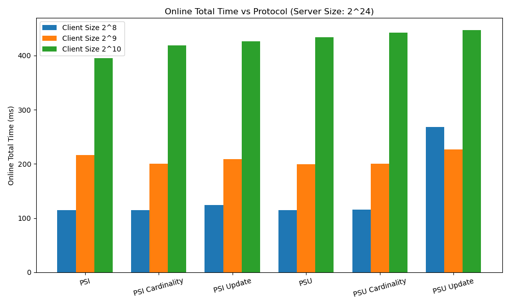
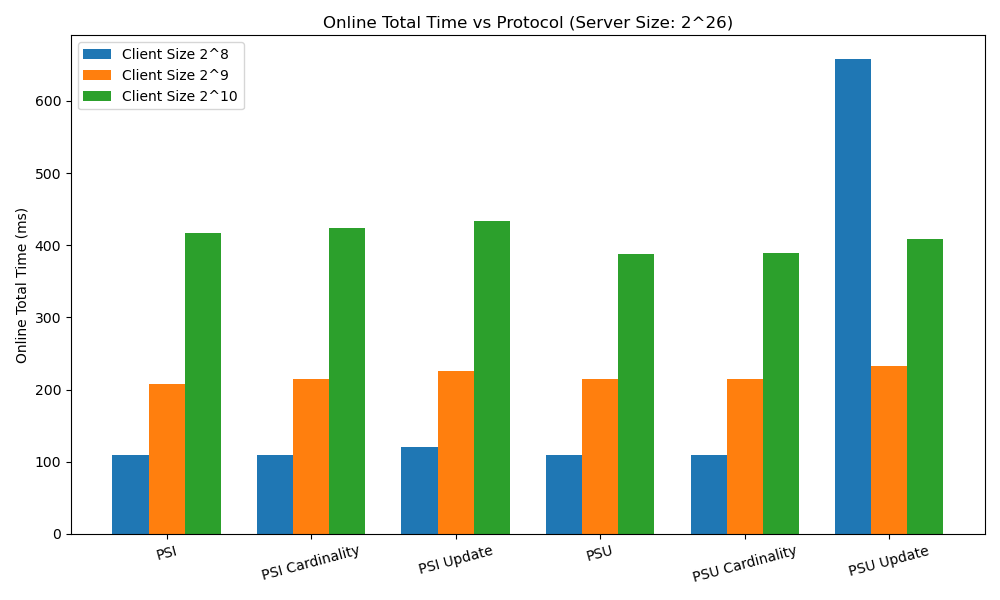
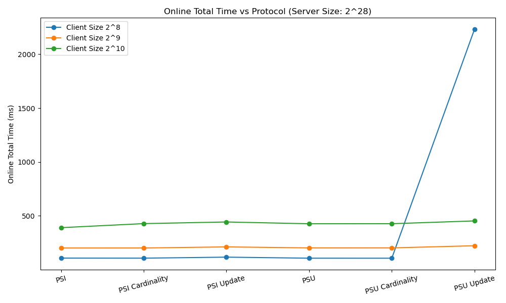
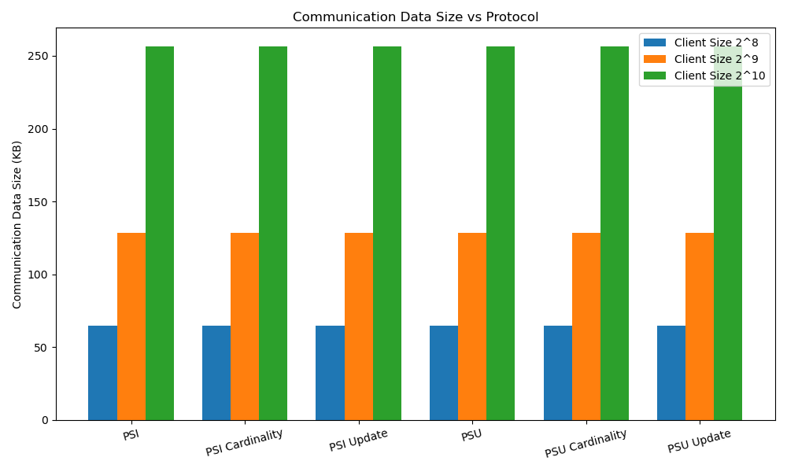

# Doubly-efficient Unbalanced  PSI and PSU from Trusted Hardware with Offline Pre-processing 

## Abstract
This repository contains the reference implementation for our **Unbalanced Private Set Intersection (PSI)** protocol and its variants. Built on Intel SGX and optimized with a parallel Oblivious Map (OMap) data structure, this repository also includes the complete implementation of our **Unbalanced Private Set Union (PSU)** protocol and its different variants.

> [!WARNING]
> **Hardware & Environment Warning**
> 
> To ensure maximum compatibility across different environments and standard hardware, the build scripts in this repository default to **SGX Simulation Mode (`SGX_MODE=SIM`)**. 
> Furthermore, to prevent Out-Of-Memory (OOM) crashes on machines with limited RAM, the dataset sizes inside the client and server benchmarks have been strictly fixed. 

---

## Protocol Overview

This repository implements six core protocols utilizing a preprocessing based offline-online model combined with Trusted Execution Environments (e.g., Intel SGX):
- **PSI (Unbalanced  Private Set Intersection)**: Computes the intersection between the client and the server datasets.
- **PSI-CA (Unbalanced  Private Set Intersection Cardinality)**: Computes only the cardinality (size) of the intersection and the client receives it only.
- **UPSI (Updatable Unbalanced  Private Set Intersection)**: An updatable PSI variant supporting dynamic additions/deletions on the server side.
- **PSU (Unbalanced  Private Set Union)**: It computes the union of both datasets securely and the server receives it.
- **PSU-CA (Unbalanced Private Set Union Cardinality)**: Computes the size of the set union and the server receives it only.
- **UPSU (Unbalanced  Updatable Private Set Union)**: An updatable variant of unbalanced PSU protocol.

These protocols rely heavily on two critical cryptographic dependencies:
- **OMap (Oblivious Map)**: Prevents access pattern leakage by utilizing the EnigMap data structure. Repository: [obliviouslabs/oram](https://github.com/obliviouslabs/oram) / [EnigMap Paper](https://eprint.iacr.org/2022/1083).
- **O-Shuffle (Oblivious Shuffling)**: Hides the relationship between input and output positions via the FlexWay O-Shuffle Algorithm. Repository: [odslib/oblsort](https://github.com/odslib/oblsort).

For in-depth details on each protocol, refer to the READMEs located inside the respective application folders.

## Directory Structure

Explore the dedicated READMEs for each sub-application for deeper technical insights:

```text
.
├── BLAKE3/              # Fast cryptographic hash function source code
├── applications/        # SGX Enclave Applications (PSI, PSU, Benchmarks)
│   ├── benchmark/       # Primary application for benchmarking ([README](applications/benchmark/README.md))
│   ├── omap/            # Core oMap functionality testing ([README](applications/omap/README.md))
│   ├── psi/             # Standard Private Set Intersection ([README](applications/psi/README.md))
│   ├── psi_card/        # PSI Cardinality ([README](applications/psi_card/README.md))
│   ├── psi_update/      # PSI Update ([README](applications/psi_update/README.md))
│   ├── psu/             # Private Set Union ([README](applications/psu/README.md))
│   ├── psu_card/        # PSU Cardinality ([README](applications/psu_card/README.md))
│   └── psu_update/      # PSU Update ([README](applications/psu_update/README.md))
├── cmake/               # CMake configuration modules
├── omap/                # Core C++ library for Oblivious Data Structures
├── tests/               # Unit testing modules
└── tools/
    └── docker/          # Reproducible Docker environment build files
```

---

## Building and Execution Workflow

To run the protocols, you will need to execute the server and the client on two different machines (or two different terminals on the same machine). 

### Step 1: Building and Running the Docker Container (On Both Machines)
First, build and enter the isolated Docker environment which contains all the necessary dependencies (CMake, Ninja, Intel SGX SDK).

```bash
# Build the Docker image
docker build -t cppbuilder:latest ./tools/docker/cppbuilder

# Run and enter the container interactively
docker run -v /tmp/omapbackend:/ssdmount --privileged -it --rm -v $PWD:/builder -p 8080:8080 cppbuilder
```

### Step 2: Launching the SGX Server (Machine 1)
Inside the container on the Server Node, navigate to the benchmark application directory and use the automated build script to compile the enclave and start the server host.

```bash
cd applications/benchmark/
./algo_runner.sh 1
```

Once executed, the server will successfully build the enclave and present an **interactive menu**. 
Enter the number corresponding to the protocol you wish to benchmark (e.g., `1` for standard PSI). Following this, you will be prompted to enter the server set size as a power of 2 (e.g., `24` for $2^{24}$). The server will then generate the RSA keys, initialize the Oblivious Map in the enclave, and state that it is listening on port 8080.

### Step 3: Compiling and Running the Client (Machine 2)
Inside the container on the Client Node, navigate to the benchmark application directory to compile and run the client. *Ensure you modify the `SERVER_IP` in `client.cpp` if running across a network.*

```bash
# Navigate to the benchmark application
cd applications/benchmark/

# Compile the client executable
make client

# Run the client
./client
```

The client will present a matching interactive menu. **Select the identical protocol number** that you chose in Step 2. The client will connect to the server, exchange ciphertexts, and complete the protocol execution.

### Step 4: Interpreting the Metrics
Once the protocol finishes, the client will terminate and print the final metrics directly to your console.

Users should look for the following output to verify performance:
- **`Online time taken: [X.X] s`**
- **`Total time taken: [X.X] s`**
- **`Total communication size: [X.X] KB`**

---

## Advanced Configuration

If you wish to run the repository on a high-performance machine or explore larger dataset boundaries, you can modify the core execution variables located inside the `algo_runner.sh` script for each application.

### Changing SGX Modes (HW vs SIM)
By default, the repository runs in Simulation Mode (`SIM`). If you have compatible Intel hardware and the SGX drivers installed, you can switch to Hardware Mode:
1. Open `algo_runner.sh`.
2. Change `SGX_MODE=SIM` to `SGX_MODE=HW`.

### Changing Dataset Sizes
By default, the experiments use synthetically generated sets of fixed sizes. If you wish to change the size of the evaluated datasets, you can do so by manipulating the variables directly in the source code:
- **Client Set Size**: Open `client.cpp` in the respective application's directory and modify the `client_set` variable (which defines the client's input array).
- **Server Set Size**: Open `App/TrustedLibrary/Libcxx.cpp` in the respective application's directory and modify the `server_set` variable.

### Disk I/O Settings
The `DISK_IO` parameter dictates whether the Oblivious Map aggressively swaps memory to the external disk to circumvent enclave memory limits.
- Set `DISK_IO=0` in `algo_runner.sh` to keep all data securely inside the enclave RAM. (Provides faster performance but strictly limits maximum dataset sizes before causing OOM).
- Set `DISK_IO=1` (Default) to enable external disk swapping for large datasets.

### Enclave RAM Size (Heap Size)
The maximum amount of RAM the enclave is allowed to utilize is controlled dynamically by the `algo_runner.sh` script using the `<HeapMaxSize>` tag. 
To increase the Enclave RAM allocation for larger datasets, modify the `MIN_ENCLAVE_SIZE` and `MAX_ENCLAVE_SIZE` bounds in `algo_runner.sh`.

### Server Backend Size (Handling Bigger Elements)
The current configuration optimizes memory footprints based on the standard protocol requirements. If you wish to run the application with **bigger elements** (i.e., larger cryptographic payloads or keys), you must correspondingly increase the server's backend storage size. To do this, modify the `size_t BackendSize` variable located in the `Enclave/TrustedLibrary/omap_test.cpp` file of the respective application directory.

> [!TIP]
> **Backend Size Logic:**
> When calculating the required backend storage for custom element sizes, you can take a **conservative approach of 64 bytes per element**. Therefore, if you are computing an intersection for $N$ custom elements, you should configure the `BackendSize` variable to accommodate at least $N \times 64$ bytes of storage. This buffer safely accounts for metadata and cipher overhead.

## Experimental Results

Below are the benchmark results of the different protocols (PSI, PSI Cardinality, PSI Update, PSU, PSU Cardinality, PSU Update) evaluated across varying Server Set Sizes ($2^{24}$, $2^{26}$, $2^{28}$) and Client Set Sizes ($2^{8}$, $2^{9}$, $2^{10}$). 

Our experimental setup features a 3rd-generation Intel Ice Lake Xeon Platinum 8370C 32-core processor running at a 2.80 GHz base clock, L3 cache size of 48 MB per CPU package, 256 GB of system RAM, 2400 GB of local storage, 30 GB SSD, and 192 GB of Enclave Page Cache (EPC). The experiments consistently utilized a 3992-byte page size (padded to 4KB on disk swap). The client setup is a low-end desktop with an Intel 12th-generation i3-12100 processor running at 4.30 GHz clock speed, 8 GB of system RAM, and 12 MB of cache memory. We map all data items to a fixed 128-bit value using a predefined collision-resistant hash function (e.g., BLAKE3).

For reference, these experiments were run on the following hardware:
- **Server Node:** Intel Ice Lake Xeon Platinum 8370C 32-core Processor (2.80 GHz base clock, 48 MB L3 cache) with 256 GB RAM, 2400 GB local storage, 30 GB SSD, and 192 GB EPC.
- **Client Node:** Intel 12th-generation i3-12100 Processor (4.30 GHz) with 8 GB RAM and 12 MB cache.

### Online Total Time
The following graphs illustrate the Online Total Time (in milliseconds) for each protocol across the different Server Set Sizes.





### Communication Data Size
The communication data size (in KB) relies purely on the Client Set Size and the underlying protocol semantics (independent of the Server Set Size). 


